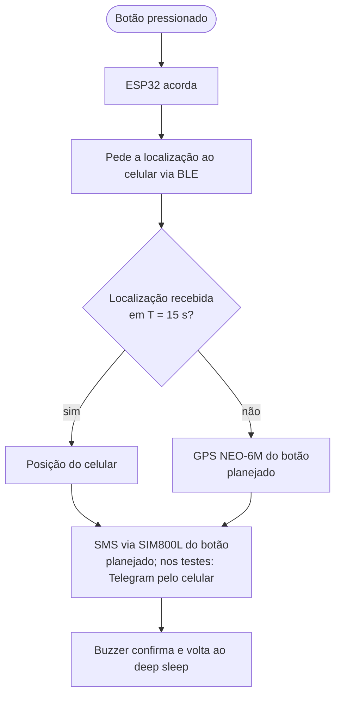

# Botão de Pânico Compacto com Fallback de Localização Independente do Celular

Dispositivo vestível de emergência baseado em ESP32: aperta o botão, o botão pede a localização ao celular por Bluetooth; se o celular não responder em 15 s, usa o próprio GPS. Nos dois casos, o SMS sai do módulo GSM do próprio botão. Nos testes desta etapa, a mensagem saiu do celular pelo Telegram, em menos de 3 s.

**Autores:** Letícia Valladão e Vinicius Dias
**Disciplina:** IBM3118 Sistemas Embarcados e IoT, IBMEC
**Professor:** Rigel Fernandes
**Grupo:** G7
**Artigo:** "A Compact Panic Button for Women's Safety with Smartphone-Independent Location Fallback" (SBrT)
**Página do celular:** <https://ticiive.github.io/A-Compact-Panic-Button-for-Women-s-Safety-with-Smartphone-Independent-Location-Fallback/>

<!-- adicionar foto do protótipo em img/prototipo.jpg -->

---

## 1. Motivação e problema

Segundo o Dossiê Mulher 2026 do ISP-RJ, 159.041 meninas e mulheres foram vítimas de algum tipo de violência no estado do Rio de Janeiro em 2025 (uma a cada três minutos), e houve 105 feminicídios.

Uma das premissas deste projeto é que, numa agressão, assalto ou sequestro, uma das primeiras ações do agressor tende a ser descartar o celular da vítima. Isso significa que um botão de pânico que depende exclusivamente do celular para enviar o alerta falha justamente quando é mais necessário. O projeto propõe um dispositivo vestível com dois caminhos independentes de localização: o celular como caminho rápido e o GPS próprio do botão como fallback, com o SMS sempre enviado pelo GSM do botão.

---

## 2. Arquitetura proposta

O sistema tem dois componentes físicos:

- **Botão vestível (ESP32 + NEO-6M + SIM800L):** dispara o alerta, pede a localização ao celular via BLE e aguarda o ACK. Se o ACK não chegar, lê o próprio GPS. Nos dois casos, envia o SMS pelo SIM800L. Fica em deep sleep entre eventos para economizar bateria.
- **Celular:** fornece a localização via BLE quando disponível, respondendo com ACK "lat;lon;acc". Não é responsável pelo envio final da mensagem.

O handover funciona assim: se o ACK do celular não chegar em T = 15 s, o botão liga o próprio GPS. T é um tempo limite de espera, não um intervalo de envio. Um T muito curto dispararia o fallback enquanto o BLE ainda reconecta após o wake-up; um T muito longo atrasaria o alerta quando o celular realmente não está disponível.

### Diagrama de fluxo (dois caminhos)



### Diagrama de sequência (caminho do celular, como testado na AP1)

```mermaid
sequenceDiagram
    participant ESP as Botão vestível (ESP32)
    participant CEL as Celular (Chrome)
    participant TG as Telegram

    ESP->>ESP: Aperto detectado, wake-up
    ESP->>CEL: Anúncio BLE (PanicButton)
    CEL->>ESP: Conexão GATT
    loop A cada 500 ms até ACK
        ESP->>CEL: Notify ALERT
    end
    CEL->>CEL: Geolocalização (enableHighAccuracy)
    CEL->>TG: sendMessage (link do mapa + precisão)
    TG-->>CEL: 200 OK
    CEL->>ESP: Write ACK "lat;lon;acc"
    ESP->>ESP: LED azul + buzzer
    ESP->>ESP: Deep sleep
```

---

## 3. Estado atual: protótipo da AP1 versus versão final

| Componente | Protótipo AP1 | Versão final | Referência que justifica a escolha |
|---|---|---|---|
| Microcontrolador | ESP32-WROVER-DEV (placa do laboratório) | ESP32 compacta (tipo SuperMini) | Dzahir e Chia 2023 (consumo do ESP32 com e sem deep sleep) |
| Localização (caminho primário) | Geolocalização do navegador (Wi-Fi do notebook nos testes) | App nativo no celular | Dedes e Dempster 2005 (A-GPS, posicionamento indoor) |
| GPS do próprio botão (fallback) | LED vermelho (GPIO 27), simulado | NEO-6M | Mallapur 2025, Mishra 2025, Purnima 2025, Sudheer 2025 |
| GSM do próprio botão (SMS nos dois caminhos) | LED vermelho (GPIO 26), simulado; SIM800L soldado, ainda não integrado | SIM800L enviando SMS | Purnima 2025 |
| Confirmação ao usuário | Buzzer (GPIO 32) | Buzzer | Mallapur 2025 |
| Alimentação | USB do computador | LiPo 3,7 V 2000 mAh com carregador TP4056 | Mishra 2025, Purnima 2025, Caracas 2011 |
| Estratégia de energia | Deep sleep com wake-up pelo botão | Idem | Caracas et al. 2011 |

---

## 4. Hardware

### Ligações na protoboard

| Componente | Pino da placa | Observação |
|---|---|---|
| Botão | GPIO 33 e GND | Pernas na diagonal; sem resistor externo (pull-up interno ativado por software) |
| Buzzer | GPIO 32 e GND | Ativo em nível alto |
| LED azul (caminho celular) | GPIO 13 e GND | Resistor de 220 a 330 Ohm em série para o GND |
| LED vermelho (GPS simulado) | GPIO 27 e GND | Resistor de 220 a 330 Ohm em série para o GND |
| LED vermelho (GSM simulado) | GPIO 26 e GND | Resistor de 220 a 330 Ohm em série para o GND |

A trilha de GND da protoboard é dividida no meio e precisa de uma ponte de fio para conectar os dois lados.

### Notas de montagem

- **GPIO 33 para o botão:** é um pino RTC, necessário para acordar a placa do deep sleep via wake-up por ext0. Pinos comuns não funcionam para esse fim.
- **Pinos a evitar:** GPIO 16 e 17 (usados pela PSRAM na WROVER), GPIO 12 (pino de strapping, pode impedir o boot se puxado para cima na inicialização), RX/TX (GPIO 1 e 3, usados pelo Serial) e os pinos da flash interna (GPIO 6 a 11).
- **Cabo USB:** usar cabo de dados, não de carga; cabos só de carga não têm os fios D+ e D- e a placa não aparece no computador.

### Integração planejada do SIM800L (ainda não feita)

O módulo SIM800L já foi soldado mas ainda não foi integrado ao firmware.

- **Alimentação:** entre 3,4 e 4,4 V, com picos de até 2 A na transmissão. Não alimentar pelo pino 3V3 da placa (corrente insuficiente); usar a bateria LiPo diretamente.
- **Capacitor:** 1000 µF perto do pino VCC do módulo para absorver os picos de corrente.
- **GND comum** com a ESP32.
- **Conexão serial:** TXD do módulo no GPIO 18 da placa; RXD do módulo no GPIO 19 da placa.
- **SIM card:** micro SIM sem PIN habilitado e com crédito ativo.
- **Verificação de rede:** o LED do módulo piscando a cada 3 s indica registro bem-sucedido na rede.
- **Comandos de teste:** `AT` (deve responder `OK`), `AT+CSQ` (nível do sinal), `AT+CREG?` (status de registro).
- **Risco:** o SIM800L opera em 2G (GSM/GPRS). Algumas operadoras brasileiras têm planos de desligamento gradual das redes 2G.

---

## 5. Software

### Firmware

- **IDE:** Arduino IDE 2.x
- **Pacote de placas:** esp32 da Espressif, versão 3.3.11
- **Placa selecionada:** "ESP32 Dev Module"
- **Upload Speed:** 115200
- **Serial Monitor:** 115200 baud

> **Mac com Apple Silicon:** na primeira vez, a IDE pode dar o erro `bad CPU type in executable`. Solução: instalar o Rosetta com `softwareupdate --install-rosetta --agree-to-license`.

### Diretivas de compilação

O firmware tem duas diretivas independentes no topo do arquivo:

```cpp
#define USE_DEEP_SLEEP 1   // 1 = dorme entre acionamentos; 0 = fica acordada
#define MEASURE_MODE   1   // 1 = T de 60 s (medição); 0 = T de 15 s (produção)
```

| `USE_DEEP_SLEEP` | `MEASURE_MODE` | Comportamento |
|---|---|---|
| 0 | 0 | Placa acordada, T = 15 s. Modo de produção sem deep sleep. |
| 0 | 1 | Placa acordada, T = 60 s. Para medir tempos sem risco de fallback acidental. |
| 1 | 0 | Deep sleep, T = 15 s. Modo de produção final. |
| 1 | 1 | Deep sleep, T = 60 s. Configuração usada nos experimentos desta AP1. |

### Protocolo BLE

- **Nome do dispositivo:** `PanicButton`
- **Serviço (Nordic UART):** `6e400001-b5a3-f393-e0a9-e50e24dcca9e`
- **Característica ALERT** (ESP32 para celular, notify): `6e400003-b5a3-f393-e0a9-e50e24dcca9e`
  - Payload: string `"ALERT"`, reenviada a cada 500 ms até o ACK chegar.
- **Característica ACK** (celular para ESP32, write): `6e400002-b5a3-f393-e0a9-e50e24dcca9e`
  - Payload: string `"lat;lon;acc"` com a localização confirmada.

### Formato das linhas de log (Serial Monitor)

```
RESULT,tentativa,modo,caminho,tempo_ms,lat;lon;acc
MEAS,tentativa,conectou_ms,ack_ms
```

Exemplos (coordenadas fictícias):

```
RESULT,3,deepsleep,celular,2518,-22.90;-43.20;35
MEAS,3,593,2518
RESULT,18,deepsleep,fallback,-,-
```

### Página do celular

Arquivo `docs/index.html`, hospedado no GitHub Pages (HTTPS obrigatório para Web Bluetooth e geolocalização).

- **Web Bluetooth:** conecta ao dispositivo `PanicButton`, subscreve notificações da característica ALERT e escreve o ACK na característica ACK.
- **Geolocalização:** `enableHighAccuracy: true`, `timeout: 10000`, `maximumAge: 0`.
- **Telegram:** envia mensagem com link do mapa (`maps.google.com/?q=lat,lon`) e precisão em metros via Bot API (`sendMessage`).
- **Token do bot:** fixo na constante `BOT_TOKEN` na página. A pessoa informa apenas o `chat_id` de quem recebe o alerta (obtido com o `@userinfobot` após abrir o bot no Telegram e tocar em Iniciar). O `chat_id` é salvo no `localStorage` do navegador.
- **Compatibilidade:** funciona no Chrome (computador e Android) e no Bluefy (iPhone). Não funciona no Safari, que não implementa Web Bluetooth.

---

## 6. Customizações e esforços de desenvolvimento

Esta seção descreve o que foi desenvolvido especificamente para este projeto, além de exemplos e bibliotecas padrão.

### a) Protocolo de alerta próprio sobre BLE GATT

**Padrão disponível:** a biblioteca BLE do Arduino para ESP32 oferece um servidor GATT genérico; os exemplos mostram apenas troca de strings.

**Problema:** uma única notificação BLE pode chegar antes de o celular terminar de subscrever as notificações, fazendo com que o alerta nunca fosse recebido.

**Solução:** reutilizamos as UUIDs do serviço Nordic UART com semântica própria: a característica ALERT é reenviada a cada 500 ms em loop até chegar o ACK, cobrindo qualquer atraso na subscrição. Implementado em `runAlertCycle()`.

### b) Lógica de handover com tempo limite T

**Padrão disponível:** nenhum exemplo de handover multicanal.

**Problema:** era preciso decidir automaticamente quando desistir do celular e acionar o fallback.

**Solução:** `runAlertCycle()` aguarda o ACK por `T_MS`. Se o ACK chegar, acende o LED azul e registra os tempos. Se não chegar, acende os LEDs vermelho (GPS simulado, 1 s) e vermelho (GSM simulado), simulando o GPS e o SMS do próprio botão. T = 15 s cobre com folga a reconexão BLE após o wake-up (mediana de 615 ms) e a entrega completa do alerta pelo celular em deep sleep (mediana de 2,6 s).

### c) Deep sleep com wake-up pelo botão (ext0 no GPIO 33)

**Padrão disponível:** a documentação do ESP32 mostra `esp_sleep_enable_ext0_wakeup`, mas omite detalhes sobre pull-ups e liberação de pinos após o boot.

**Problema 1:** o pull-up comum (`INPUT_PULLUP`) é desligado durante o deep sleep, fazendo o pino flutuar e causando wake-ups espúrios.

**Solução 1:** antes de dormir, ativar o pull-up RTC com `rtc_gpio_pullup_en(GPIO_NUM_33)`, que mantém o nível alto mesmo com a CPU desligada.

**Problema 2:** após o wake-up, o pino ainda está configurado como pino RTC e não responde a `digitalRead()`.

**Solução 2:** no início do `setup()`, liberar o pino com `rtc_gpio_deinit(GPIO_NUM_33)` para restaurá-lo ao modo GPIO comum.

**Problema 3:** se o botão ainda estivesse pressionado ao entrar em sleep, a placa acordaria imediatamente.

**Solução 3:** em `goToSleep()`, aguardar o botão ser solto (`while digitalRead(PIN_BUTTON) == LOW`) antes de configurar o wake-up.

### d) LEDs semiacesos durante o deep sleep (gpio_hold)

**Problema:** durante o deep sleep, os pinos de saída ficam flutuando. Os LEDs vermelhos acendiam fracamente, causando confusão visual.

**Solução:** antes de dormir, congelar o estado dos três pinos de LED com `gpio_hold_en()`. No boot, liberar com `gpio_hold_dis()` antes de configurar os pinos. Implementado em `goToSleep()` e `setup()`.

### e) Contador de tentativas com RTC_DATA_ATTR

**Problema:** variáveis comuns são apagadas a cada deep sleep, perdendo o número de tentativas.

**Solução:** declarar `RTC_DATA_ATTR int trial` para armazenar o contador na RTC RAM, que é preservada entre deep sleeps enquanto houver alimentação.

### f) Encerrar a conexão BLE antes de dormir

**Problema:** sem desconexão explícita, a placa simplesmente sumia do ar. O celular levava de alguns segundos a dezenas de segundos para detectar a queda. Se a usuária apertasse o botão nesse intervalo, a página tentava reconectar antes de a queda ser detectada e frequentemente travava, fazendo o alerta cair no fallback.

**Solução:** em `goToSleep()`, chamar `server->disconnect(server->getConnId())` antes de configurar o sleep. Com isso, a queda passou a ser detectada em cerca de 3 a 4 s após cada alerta, e a página inicia a reconexão mais cedo e de forma mais confiável.

### g) Instrumentação para os experimentos

**Necessidade:** medir o tempo de reconexão e o tempo de ACK contados a partir do aperto do botão, para avaliar se o sistema é compatível com T = 15 s.

**Solução:** `millis()` recomeça no wake-up, então `t0 = millis()` capturado no início do `setup()` serve como referência. A variável global `tConnect` é preenchida no callback `onConnect` com `millis()` apenas na primeira conexão do ciclo (protegida por `if (tConnect == 0)`). A linha `MEAS,tentativa,conectou_ms,ack_ms` é impressa no Serial logo após o RESULT. A diretiva `MEASURE_MODE 1` aumenta T para 60 s, permitindo observar a reconexão completa sem cair no fallback.

### h) Página do celular feita do zero

**Padrão disponível:** exemplos de Web Bluetooth mostram conexão simples sem reconexão automática.

**Problema 1:** ao sair do deep sleep, a placa encerra a conexão. O celular precisa reconectar sem que a usuária precise abrir o seletor de dispositivos a cada aperto.

**Solução 1:** reutilizar o mesmo objeto `BluetoothDevice` obtido na primeira conexão. O listener `gattserverdisconnected` chama `reconnect()`, que tenta `connectGatt()` em loop. Para evitar que o `connect()` fique pendurado quando a placa está dormindo, cada tentativa tem um limite de 4 s via `withTimeout()` (implementado com `Promise.race`). Uma flag `reconnecting` evita loops paralelos.

**Problema 2:** cada clique no botão "Conectar" adicionava um novo listener de `gattserverdisconnected`; cada reconexão bem-sucedida em `connectGatt()` adicionava um novo listener de `characteristicvaluechanged`. Com 4 cliques, cada evento disparava 4 vezes, causando 4 alertas paralelos no Telegram.

**Solução 2:** o listener de desconexão é registrado apenas uma vez (flag `disconnectListenerAdded`). A atribuição `alertChar.oncharacteristicvaluechanged = handleAlert` substitui qualquer handler anterior em vez de acumular.

### i) Telegram nos testes, SMS no produto

**Motivo:** o iOS não permite que apps ou páginas enviem SMS sozinhos. Por isso, nos testes a mensagem sai da página pelo Telegram; no produto final, o celular só fornece a localização no ACK e o SMS sai do SIM800L do próprio botão, nos dois caminhos.

### j) Coleta dos dados pelo Terminal sem gravar coordenadas

**Problema:** o processo `serial-monitor` da Arduino IDE ocupa a porta serial exclusivamente; ao rodar os testes com outro processo lendo a porta, a IDE dava conflito.

**Solução:** fechar a IDE e ler a porta diretamente pelo Terminal:

```bash
(stty 115200; cat) < /dev/cu.usbserial-110 | grep --line-buffered -E "MEAS|fallback" | tee -a ~/Desktop/meas.txt
```

O filtro `grep` mantém apenas as linhas `MEAS` e `fallback`, descartando as linhas `RESULT` que contêm as coordenadas reais. Se a porta estiver ocupada por outro processo, identificar com `lsof /dev/cu.usbserial-110` e encerrar com `kill <PID>`.

---

## 7. Dificuldades encontradas

- **Placa não aparecia no computador:** cabo USB só de carga, sem os fios de dados. Trocado por cabo de dados.
- **"bad CPU type in executable":** compilador x86 sem Rosetta. Resolvido com `softwareupdate --install-rosetta --agree-to-license`.
- **"Missing FQBN":** nenhuma placa selecionada na IDE. Resolvido instalando o pacote esp32 da Espressif e selecionando "ESP32 Dev Module".
- **"Unable to verify flash chip connection"** em 921600: Upload Speed reduzido para 115200.
- **Caracteres estranhos no Serial Monitor:** monitor configurado em 9600, trocado para 115200.
- **Botão não acordava a placa:** trilha de GND da protoboard sem ligação (dividida no meio) e um resistor externo desnecessário interferindo no pino. Resolvido com ponte de fio e remoção do resistor.
- **LEDs não acendiam:** mesmo problema de trilha dividida. Resolvido com a ponte.
- **LEDs semiacesos no deep sleep:** pinos flutuando. Resolvido com `gpio_hold_en` (item f da seção anterior).
- **Telegram respondendo 404:** o `chat_id` tinha sido preenchido no lugar do token do bot e vice-versa.
- **"navigator.bluetooth undefined":** tentativa de usar no Safari, que não implementa Web Bluetooth. Resolvido usando o Chrome.
- **Alerta duplicado com aba em segundo plano:** com a aba minimizada, o Chrome atrasou a geolocalização em 14 a 22 s, a placa foi para o fallback e o alerta ainda chegou pelo celular depois. O sistema falha para o lado da redundância (dois alertas), não da perda.
- **Reconexão travada em deep sleep:** `device.gatt.connect()` sem limite de tempo ficava pendurado. Resolvido com `withTimeout(connectGatt(), 4000)` e desconexão explícita antes do sleep.
- **Porta serial ocupada:** processo `serial-monitor` da IDE. Resolvido fechando a IDE e lendo a porta diretamente pelo Terminal.

---

## 8. Experimentos e resultados

### Configuração

- Placa: ESP32-WROVER-DEV com firmware `USE_DEEP_SLEEP 1`, `MEASURE_MODE 1` (T = 60 s).
- O papel do celular foi desempenhado pela página `docs/index.html` no Chrome de um MacBook.
- Localização via Wi-Fi do notebook, precisão informada de aproximadamente 35 m. Na maioria das tentativas, o navegador reutilizou a posição em cache (tempo de dezenas de milissegundos). Os tempos de ACK são, portanto, um limite inferior para um celular que precise obter posição GNSS nova.

### Resultados quantitativos

| Condição | n | Mediana (ms) | Média ± dp (ms) | Faixa (ms) |
|---|---|---|---|---|
| Acordada, ACK | 16 | 555 | 589 ± 123 | 520 a 1030 |
| Deep sleep, reconexão BLE | 19 | 615 | 676 ± 144 | 574 a 1113 |
| Deep sleep, ACK | 19 | 2602 | 2682 ± 691 | 2039 a 5262 |

- **Série acordada:** 16 de 16 alertas pelo caminho do celular. O maior valor (1030 ms) corresponde ao tempo total de ACK; o envio ao Telegram teve mediana de 348 ms, sobrando cerca de 200 ms para o overhead de BLE e processamento.
- **Série deep sleep:** 21 de 22 alertas pelo caminho do celular; 2 tentativas excluídas da estatística por terem exigido conexão manual pelo seletor do navegador. A única falha (tentativa 18) foi a página travando na reconexão antes da correção implementada na Tarefa 2. O deep sleep acrescenta cerca de 2 s por alerta em relação ao modo acordado, mas continua bem dentro de T = 15 s. O maior valor de ACK (5262 ms, tentativa 2) coincide com a única vez em que o navegador obteve posição nova em vez de reusar o cache (2631 ms para a geolocalização); sem essa tentativa, ACK = 2539 ± 303 ms.

### Resultados qualitativos

- Fluxo completo funcionando: mensagem no Telegram com link do Google Maps e precisão, LED azul acendendo após o ACK.
- Decisão de fallback funcionando: LEDs vermelho do GPS (GPIO 27) e do GSM (GPIO 26) acendendo quando T expira.
- **Alerta duplicado com aba em segundo plano:** com a aba minimizada no Chrome, a geolocalização atrasou 14 a 22 s, a placa foi para o fallback e o Telegram ainda chegou depois. O sistema falha para o lado da redundância, não da perda do alerta.
- **Necessidade de app nativo:** a geolocalização via navegador tem restrições de segundo plano no iOS e pode ser interrompida; um app nativo (item de trabalho futuro) elimina essa limitação.

Os dados individuais e o script de análise estão na pasta [`results/`](results/).

```bash
python3 results/analyze.py
```

---

## 9. Limitações e trabalhos futuros

- **Integração do NEO-6M e SIM800L:** testar o fallback de ponta a ponta com envio real de SMS.
- **Alimentação com LiPo:** medir a corrente na fonte de bancada nos três estados (deep sleep, acordada ociosa, acordada conectada) e estimar a autonomia em função do intervalo de envio periódico Δ:

  `I_médio = (I_ativo × t_ativo + I_sono × (Δ − t_ativo)) / Δ`

  `Autonomia = 2000 mAh / I_médio`

- **Envio periódico da localização:** o protótipo atual envia uma vez por aperto. Implementar envio a cada Δ segundos até a usuária cancelar.
- **App nativo no celular:** substituir a página web por um app Android/iOS para resolver as restrições de geolocalização em segundo plano.
- **GSM sempre registrado ou acordado sob demanda:** manter o SIM800L registrado na rede entre eventos gasta energia; acordá-lo só no alerta adiciona alguns segundos de registro.
- **Versão compacta:** substituir a ESP32-WROVER-DEV de laboratório por uma ESP32 menor (tipo SuperMini) para o dispositivo final.

---

## 10. Segurança e privacidade

O token do bot do Telegram está público na página `docs/index.html`, por decisão do grupo para simplificar o uso durante a disciplina. Ele deve ser revogado no BotFather ao fim da disciplina. Nenhuma coordenada real é publicada em nenhum arquivo deste repositório.

---

## 11. Referências

- Mallapur, S. et al. "Women safety device using IoT". *Journal of Science and Research Technology* (JSRT), 2025.
- Sogi, N. R. et al. "SMARISA: A Raspberry Pi based smart ring for women safety using IoT". *ICIRCA*, 2018.
- Juárez, M. "Technology-facilitated gender-based violence". *International Criminology*, 2026.
- Akram, W., Jain, N. e Hemalatha, C. S. "Design of a smart safety device for women using IoT". *Procedia Computer Science*, 2019.
- Caracas, A. et al. "Low-power personal emergency response". *IEEE SECON*, 2011.
- Mishra, R. e Saha, P. "SafeGuard Bangle: IoT-based women safety device". *IEMENTech*, 2025.
- Dzahir, M. A. M. e Chia, K. K. "ESP32 deep sleep power optimization for IoT applications". *3ICT*, 2023.
- Purnima, G. et al. "Smart women safety device using ESP32". *ICSCDS*, 2025.
- Sudheer, K., Naveen, K. e P., H. "IoT-based women safety system with GPS and GSM". *ICSSS*, 2025.
- Dedes, G. e Dempster, A. G. "Indoor GPS positioning: challenges and opportunities". *VTC-2005-Fall*, IEEE, 2005.
- Instituto de Segurança Pública do Rio de Janeiro (ISP-RJ). *Dossiê Mulher 2026*. Rio de Janeiro, 2026.
